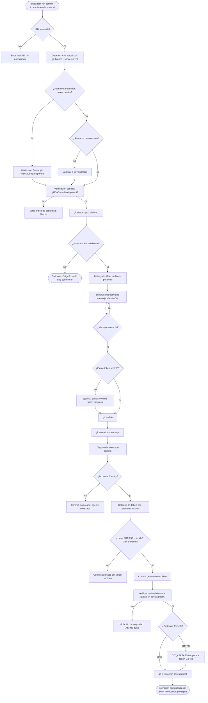

# Funcionalidad y Automatización: Script de Commit Interactivo y Seguro para `development`

> Ámbito: **Herramientas / Git Workflow / DevOps Local** · Fecha: 2026-09-14 · Estado: **Implementado y operativo**

---

## 1. Objetivo

Garantizar un flujo de trabajo de control de versiones a prueba de errores humanos y desatenciones de agentes de IA, asegurando que todos los commits cotidianos se realicen exclusivamente sobre la rama `development`, con validación visual previa de los archivos modificados, obligatoriedad de autenticación interactiva mediante token secreto del usuario y subida garantizada y aislada a `origin/development`, haciendo técnicamente imposible la contaminación, sobreescritura o modificación accidental de la rama de producción (`production`).

---

## 2. Alcance

### Incluido
- **Verificación y cambio forzado de rama**: Detección inmediata de la rama activa. Si se detecta una rama prohibida (`production`, `main`, `master`), conmuta de forma segura e inmediata a `development`. Si se encuentra en cualquier otra rama, también cambia a `development`.
- **Doble y triple verificación**: Comprobaciones de seguridad redundantes antes de añadir archivos y justo antes de realizar el `git push`.
- **Inspección visual clasificada**: Formateo por terminal con códigos de color ANSI de todos los archivos afectados según su estado en `git status --porcelain=v1` (`[NUEVO]`, `[MODIFICADO]`, `[AÑADIDO]`, `[ELIMINADO]`, `[RENOMBRADO]`) y recuento total.
- **Salida temprana sin cambios**: Si no existen archivos tocados, el script informa limpiamente y termina con código 0 sin alterar el repositorio.
- **Solicitud interactiva de mensaje**: Captura del mensaje de commit directamente a través del dispositivo de terminal interactiva (`/dev/tty`), impidiendo mensajes vacíos o en blanco.
- **Detección y configuración guiada del token**: Comprobación de la existencia del archivo de verificación `~/.config/cifra-commit-lock/token.sha256`. Si no existe, invoca de manera guiada el asistente `scripts/commit-token-setup.sh`.
- **Ejecución protegida por hook `pre-commit`**: El hook intercepta el comando `git commit`, exige acceso directo a `/dev/tty` (bloqueando de raíz cualquier intento de agentes de IA o procesos en segundo plano), solicita el token en modo oculto, valida contra el hash SHA-256 con sal y limita a un máximo de 3 intentos con 300 segundos de timeout.
- **Protección ante fallos del commit**: Si el usuario introduce mal el token o cancela el commit, el script detecta el fallo y cancela la operación de inmediato, garantizando que **no se realice ninguna subida**.
- **Push exclusivo a `origin/development`**: Ejecución garantizada únicamente hacia `origin/development`.
- **Compatibilidad de transporte remoto**: Manejo transparente de remotos SSH nativos y remotos HTTPS (este último mediante script temporal `GIT_ASKPASS` con permisos `700` y eliminación asegurada mediante manejador `trap cleanup EXIT`).
- **Integración con npm**: Comandos `"commit"` y `"commit:dev"` integrados en `package.json` (`npm run commit`).

### Excluido
- Despliegue de código a producción (el paso a producción es un flujo manual y desacoplado, reservado a versiones estables verificadas).
- Commits automáticos o desatendidos por agentes LLM (prohibidos por diseño mediante el requisito de TTY interactiva y secreto humano).

---

## 3. Reglas de Negocio y de Seguridad

1. **Inviolabilidad de Producción**: Bajo ninguna condición el script interactivo permitirá confirmar cambios o enviar un `push` a las ramas `production`, `main` o `master`. Si la rama local actual coincide con una de ellas, conmuta obligatoriamente a `development` con advertencia destacada.
2. **Inmunidad frente a Agentes de IA**: El hook `pre-commit` requiere un descriptor de archivo interactivo vinculado a `/dev/tty`. Dado que los agentes de IA operan en subshells desatendidas sin TTY humano, cualquier intento de commit por parte de un agente es automáticamente rechazado con el mensaje: `Commit bloqueado: se necesita una terminal interactiva para el token (un agente no puede commitear).`
3. **Almacenamiento Seguro del Secreto**: El token del usuario nunca se persiste en texto claro en el repositorio ni en el sistema de archivos. Se almacena exclusivamente como un hash SHA-256 salado (`salt$hash`) en `~/.config/cifra-commit-lock/token.sha256`.
4. **Resolución Inmutable del Directorio Home**: La ruta del archivo de bloqueo se resuelve mediante `getent passwd $(id -u)` en lugar de confiar ciegamente en la variable de entorno `$HOME`, evitando evasiones por spoofing de variables de entorno.
5. **No Elevación ni Exposición de Credenciales HTTPS**: En caso de remotos HTTPS que requieran token de GitHub, las credenciales no se pasan por la línea de comandos (evitando su visualización en `ps` o logs) ni se guardan en helpers persistentes; se gestionan a través de un archivo ejecutable temporal protegido con permisos `700` que se borra irrevocablemente al salir del script.
6. **Atomicidad de Flujo**: No existe subida remota (`git push`) si el paso previo de confirmación (`git commit`) no retornó un estado de salida exactamente igual a 0.

---

## 4. Flujo Detallado de Ejecución

---

## 5. Componentes y Archivos Afectados

| Archivo | Rol en el sistema | Permisos requeridos |
|---|---|---|
| `commit-development.sh` | Script orquestador principal en la raíz del proyecto. | `755` (ejecutable) |
| `scripts/commit-development.sh` | Copia operativa del orquestador en la carpeta de scripts. | `755` (ejecutable) |
| `scripts/commit-token-setup.sh` | Asistente de configuración inicial del token con sal y endurecimiento opcional con `root`. | `755` (ejecutable) |
| `scripts/hooks/pre-commit` | Hook interceptor de Git que valida la presencia de terminal interactiva y el token del usuario. | `755` (ejecutable) |
| `package.json` | Definición de accesos directos de conveniencia (`"commit"` y `"commit:dev"`). | Lectura |
| `~/.config/cifra-commit-lock/token.sha256` | Almacén protegido del salt y del hash SHA-256 del usuario. | `600` o `644` (root) |
| `~/.config/cifra-commit-lock/pre-commit` | Destino instalado del hook activo referenciado por `core.hooksPath`. | `755` |

---

## 6. Entradas, Salidas y Códigos de Estado

- **Comandos de ejecución**:
  - `npm run commit`
  - `npm run commit:dev`
  - `./commit-development.sh`
- **Entradas interactivas**:
  1. `Introduce el mensaje del commit:` (Texto libre, obligatorio, no admite espacios vacíos).
  2. `Token de commit:` (Entrada oculta gestionada por `pre-commit` vía `/dev/tty`).
  3. `Token de acceso de GitHub:` (Entrada oculta opcional, solicitada solo si el remoto `origin` está configurado con protocolo `https://`).
- **Códigos de retorno**:
  - `0`: Operación completada con éxito o repositorio sin cambios pendientes.
  - `1`: Fallo de validación de rama, intento de ejecución en agente sin TTY, token incorrecto, commit rechazado o error de red durante el push.

---

## 7. Matriz de Errores y Casos Límite

| Caso Límite | Comportamiento del Sistema | Resultado de Seguridad |
|---|---|---|
| Desarrollador situado en rama `production` | Detecta `production` en `FORBIDDEN_BRANCHES`, emite alerta roja y ejecuta `git switch development` automáticamente. | Producción queda 100% protegida; ningún commit se añade a su árbol. |
| Repositorio con HEAD desvinculado (*detached HEAD*) | `git branch --show-current` devuelve cadena vacía; invoca `die()` de inmediato. | Operación abortada antes de tocar ningún archivo. |
| Agente de IA o script en cron intenta commitear | `exec 3<>/dev/tty` falla en el hook `pre-commit`; emite error y finaliza con código 1. | Bloqueo automático; la IA no puede generar commits. |
| Usuario introduce 3 veces un token incorrecto | Hook cuenta 3 intentos, muestra `Token incorrecto (3 de 3)` y sale con código 1. `commit-development.sh` aborta la subida. | No hay commit ni push al remoto. |
| Interrupción con Ctrl+C durante la introducción del mensaje | `read_interactive` captura la salida del descriptor, notifica `Operación cancelada por el usuario` y sale limpiamente. | Repositorio intacto; sin commits huérfanos. |
| Ausencia del archivo de token en el sistema | Script detecta `[ ! -f "$HASH_FILE" ]` e invoca automáticamente `scripts/commit-token-setup.sh` para guiar al usuario. | Experiencia de usuario asistida sin romper la seguridad. |
